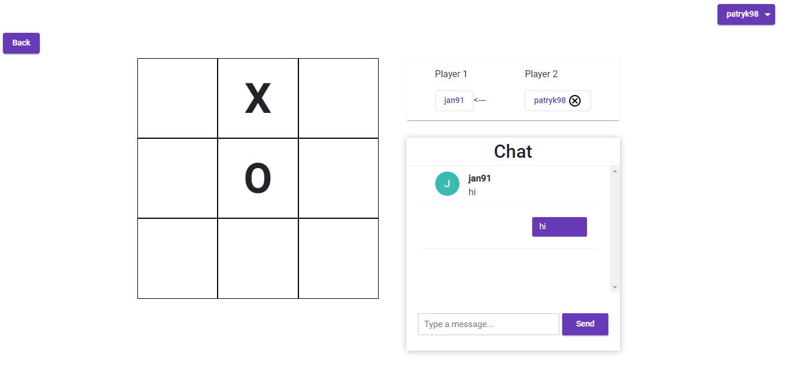

# golebnik
You can use this app for playing games such as tic tac toe and connect4 with other people via internet

Technologies used:
* Backend:
    * Java
    * Spring Boot
    * Hibernate
    * MySql
    
* Frontend
    * HTML/CSS
    * Material Design
    * Typescript
    * Angular
    
* Both
    * WebSocket/STOMP